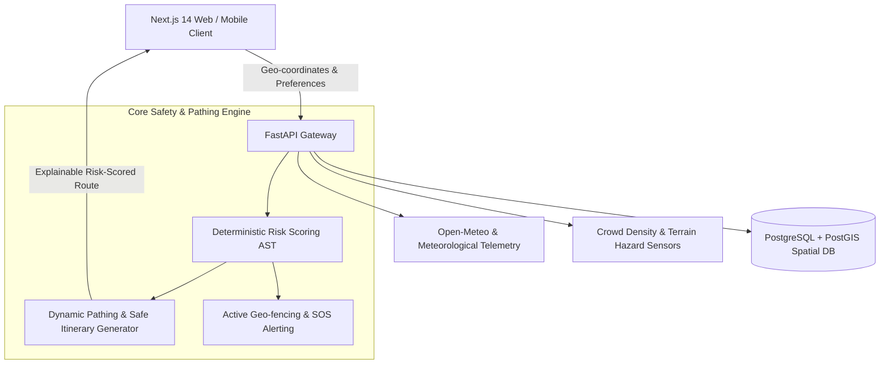

# IGNITE — System Architecture

IGNITE is an AI-powered tourist safety and dynamic route planning system designed for high reliability and explainable risk mitigation across Indian tourist corridors.

## Architectural Highlights
- **Deterministic Risk AST**: Computes dynamic safety weights using multi-factor telemetry without black-box hallucinations.
- **PostGIS Spatial Partitioning**: Sub-millisecond geographic proximity indexing for emergency services and danger zones.
- **Dynamic Re-Routing**: Real-time itinerary recalculation triggered by live weather fluctuations or crowd surges.
